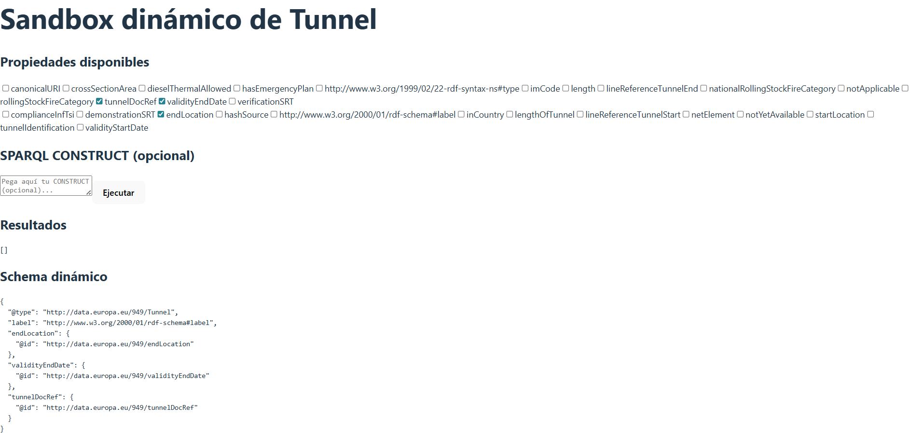

# LDkit con European Union Agency for Railways (ERA)

Este proyecto forma parte de la asignatura **Open Data and Knowledge Graphs 2025**.  

El objetivo principal fue explorar y utilizar la herramienta **LDkit** para trabajar con los datos de la **European Union Agency for Railways (ERA)**.  

Se implementaron ejemplos de LDkit para:

- Consultar y mostrar información de los datos RDF de ERA.
- Crear Lenses a partir de schemas existentes.
- Realizar consultas dinámicas y obtener resultados desde el endpoint SPARQL de ERA.

En este proyecto **no se realizaron modificaciones ni inserciones** de datos debido a la restricción, solo se replicaron ejemplos de consulta y visualización para comprobar el funcionamiento de LDkit con los datos de ERA.

---

## Instalación de LDkit

Para instalar LDkit en tu proyecto:

```bash
npm install ldkit


### Menú principal


### Sandbox


### Tunnel
