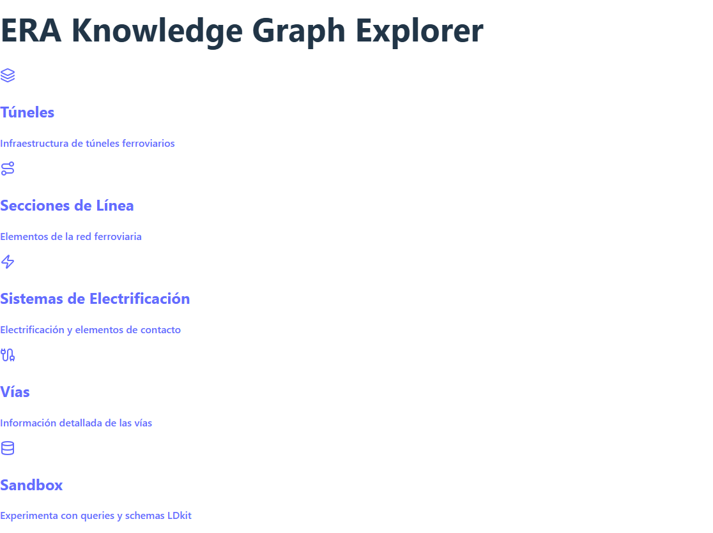
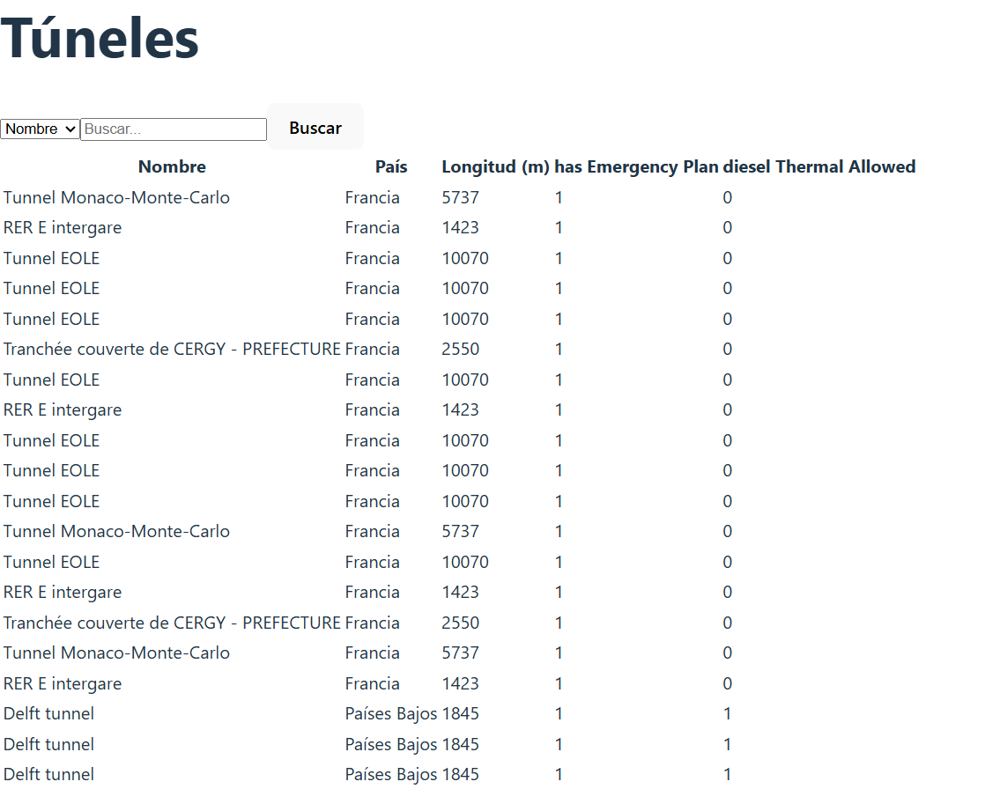

# Web React con Schemas de ERA y Sandbox dinámico

Este proyecto es una **página web simple desarrollada en React** que interactúa con los datos de ERA usando LDkit.  

### Funcionalidades:

- Implementación de varios **schemas** (Tunnel, Track, SectionOfLine, ContactLineSystem, etc.) para obtener información específica desde el endpoint SPARQL de ERA.
- Visualización de datos en listas y detalles de cada elemento, incluyendo normalización de nombres de país y otros atributos.
- **Mini Sandbox dinámico**:
  - Permite seleccionar propiedades de la clase `Tunnel` de manera interactiva.
  - Genera consultas `CONSTRUCT` dinámicas sobre los atributos seleccionados.
  - Ejecuta consultas manuales para obtener exactamente la información que se desea mostrar.

Este proyecto sirve como demostración de cómo combinar **React**, **LDkit** y **datos abiertos europeos** para explorar y consultar knowledge graphs de manera interactiva.
## Instalación de react
Para que funcione se necesita:

```bash
npm install react-router-dom
```

### Menú principal
Es un menu simple en donde he colocado los enlaces para visionar diferentes schemas y un sandbox que después explicaré

### Tunnel
Este sería como sería uno de ellos se ha usado los filtros limitados que ofrecen LDkit, y permite ordenacion tanto de los numeros como las letras y filtrado por string o números.


### Sandbox
Este un mini Sandbox sobre la clase de Tunel, primero obtengo todas las propiedades en dominio de tunnel, haciendo uso de un select, el usuario indica que propiedades le intera mostrar, las que se selecciona mostrará como se coloca en el schema que usará LDkit, y por último de forma opcional se puede poner código sparql para activar como filtro a lo obtenido del schema debido a que LDkit ofrece de forma muy limitada opciones,Ejemplo:
```bash
CONSTRUCT`
  ?s a <${ldkit.Resource}>;
     a <${era.Tunnel}>;
     <${rdfs.label}> ?label;
     <${era.inCountry}> ?inCountry;
     <${era.lengthOfTunnel}> ?length
`
.WHERE`
  ?s a <${era.Tunnel}>;
     <${rdfs.label}> ?label;
     <${era.inCountry}> ?inCountry;
     <${era.lengthOfTunnel}> ?length.
  FILTER(?length > 1000)
`
.build();
```
Importante siempre poner ldkit.Resource, sino el método no lo pilla


